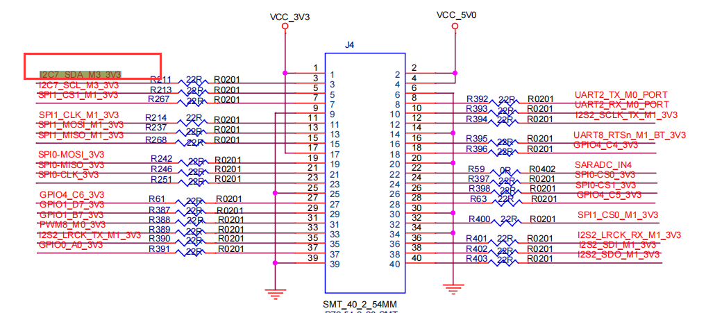
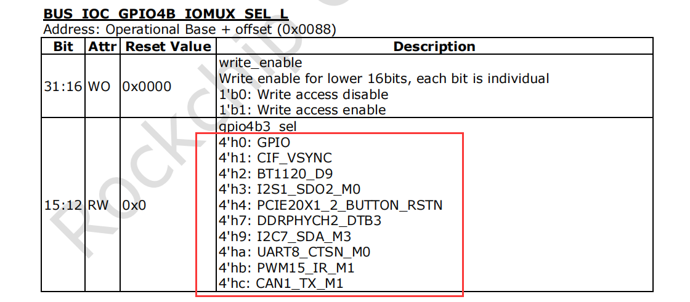
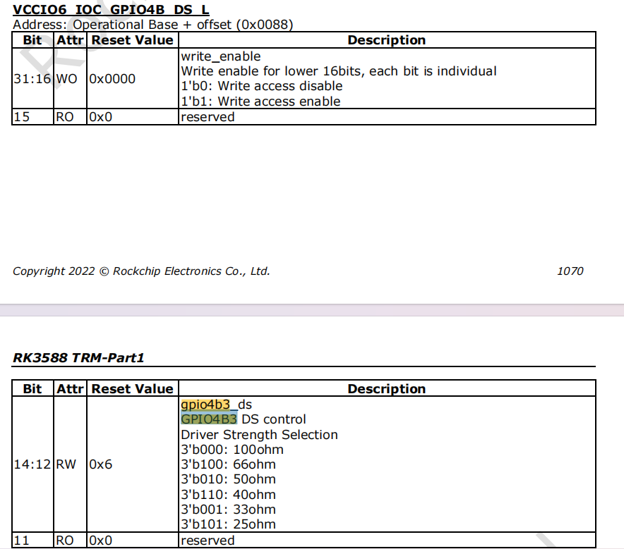
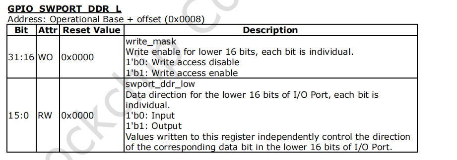
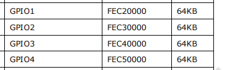
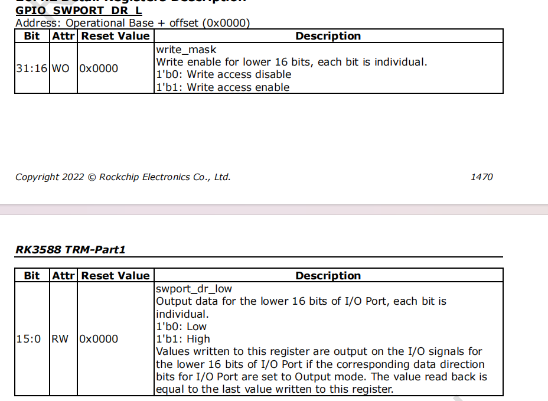
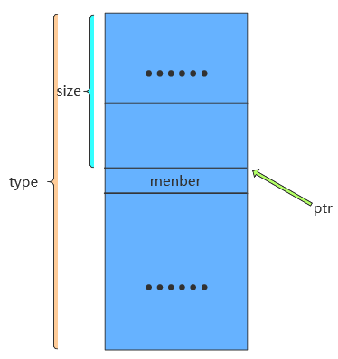

# 字符设备驱动——点亮LED灯实验

通过字符设备章节的学习，我们已经了解了字符设备驱动程序的基本框架，主要是掌握如何申请及释放设备号、 添加以及注销设备，初始化、添加与删除cdev结构体，并通过cdev_init函数建立cdev和file_operations之间的关联， cdev结构体和file_operations结构体非常重要，希望大家着重掌握。

本小节我们将带领大家做一个激动人心的小实验–点亮led。 前面我们已经通过操作寄存器的方式点亮了LED，本节我们将带领大家进入点亮开发板LED灯的世界， 学习一下如何在linux环境下驱动LED灯。

首先我们需要明白直接操作寄存器和通过驱动程序点亮LED有什么区别。

## 1. 设备驱动的作用与本质

直接操作寄存器点亮LED和通过驱动程序点亮LED最本质的区别就是有无使用操作系统。 有操作系统的存在则大大降低了应用软件与硬件平台的耦合度，它充当了我们硬件与应用软件之间的纽带， 使得应用软件只需要调用驱动程序接口API就可以让硬件去完成要求的开发，而应用软件则不需要关心硬件到底是如何工作的。 这将大大提高我们应用程序的可移植性和开发效率。

### 1.1. 驱动的作用

设备驱动与底层硬件直接打交道，按照硬件设备的具体工作方式读写设备寄存器， 完成设备的轮询、中断处理、DMA通信，进行物理内存向虚拟内存的映射，最终使通信设备能够收发数据， 使显示设备能够显示文字和画面，使存储设备能够记录文件和数据。

在系统中没有操作系统的情况下，工程师可以根据硬件设备的特点自行定义接口，如对LED定义LightOn()、LightOff()等。 而在有操作系统的情况下，设备驱动的架构则由相应的操作系统定义，驱动工程师必须按照相应的架构设计设备驱动， 如在本次实验中必须设计file_operations的接口。这样，设备驱动才能良好地整合到操作系统的内核中。

### 1.2. 有无操作系统的区别

1)无操作系统(即裸机)时的设备驱动 也就是直接操作寄存器的方式控制硬件，在这样的系统中，虽然不存在操作系统，但是设备驱动是必须存在的。 一般情况下，对每一种设备驱动都会定义为一个软件模块，包含.h文件和.c文件，前者定义该设备驱动的数据结构并声明外部函数， 后者进行设备驱动的具体实现。其他模块需要使用这个设备的时候，只需要包含设备驱动的头文件然后调用其中的外部接口函数即可。 这在STM32的开发中很常见，也相对比较简单。

2)有操作系统时的设备驱动 反观有操作系统时，首先，驱动硬件工作的的部分仍然是必不可少的，其次，我们还需要将设备驱动融入内核。 为了实现这种融合，必须在所有的设备驱动中设计面向操作系统内核的接口，这样的接口由操作系统规定，对一类设备而言结构一致，独立于具体的设备。

由此可见，当系统中存在操作系统的时候，设备驱动变成了连接硬件和内核的桥梁。操作系统的存在势必要求设备驱动附加更多的代码和功能， 把单一的驱动变成了操作系统内与硬件交互的模块，它对外呈现为操作系统的API。

操作系统的存在究竟带来了什么好处呢？

首先操作系统完成了多任务并发； 其次操作系统为我们提供了内存管理机制，32位Linux操作系统可以让每个进程都能独立访问4GB的内存空间； 对于应用程序来说，应用程序将可使用统一的系统调用接口来访问各种设备， 通过write()、read()等函数读写文件就可以访问各种字符设备和块设备，而不用管设备的具体类型和工作方式。

## 2. 内存管理单元MMU

在linux环境直接访问物理内存是很危险的，如果用户不小心修改了内存中的数据，很有可能造成错误甚至系统崩溃。 为了解决这些问题内核便引入了MMU，

### 2.1. MMU的功能

MMU为编程提供了方便统一的内存空间抽象，其实我们的程序中所写的变量地址是虚拟内存当中的地址， 倘若处理器想要访问这个地址的时候，MMU便会将此虚拟地址(Virtual Address)翻译成实际的物理地址(Physical Address)， 之后处理器才去操作实际的物理地址。MMU是一个实际的硬件，并不是一个软件程序。他的主要作用是将虚拟地址翻译成真实的物理地址同时管理和保护内存， 不同的进程有各自的虚拟地址空间，某个进程中的程序不能修改另外一个进程所使用的物理地址，以此使得进程之间互不干扰，相互隔离。 而且我们可以使用虚拟地址空间的一段连续的地址去访问物理内存当中零散的大内存缓冲区。很多实时操作系统都可以运行在无MMU的CPU中， 比如uCOS、FreeRTOS、uCLinux，以前想CPU也运行linux系统必须要该CPU具备MMU，但现在Linux也可以在不带MMU的CPU中运行了。 总体而言MMU具有如下功能：

- **保护内存：** MMU给一些指定的内存块设置了读、写以及可执行的权限，这些权限存储在页表当中，MMU会检查CPU当前所处的是特权模式还是用户模式，如果和操作系统所设置的权限匹配则可以访问，如果CPU要访问一段虚拟地址，则将虚拟地址转换成物理地址，否则将产生异常，防止内存被恶意地修改。
- **提供方便统一的内存空间抽象，实现虚拟地址到物理地址的转换：** CPU可以运行在虚拟的内存当中，虚拟内存一般要比实际的物理内存大很多，使得CPU可以运行比较大的应用程序。

到底什么是虚拟地址什么是物理地址？

当没有启用MMU的时候，CPU在读取指令或者访问内存时便会将地址直接输出到芯片的引脚上，此地址直接被内存接收，这段地址称为物理地址， 如下图所示。


简单地说，物理地址就是内存单元的绝对地址，好比你电脑上插着一张8G的内存条，则第一个存储单元便是物理地址0x0000， 内存条的第6个存储单元便是0x0005，无论处理器怎样处理，物理地址都是它最终的访问的目标。

当CPU开启了MMU时，CPU发出的地址将被送入到MMU，被送入到MMU的这段地址称为虚拟地址， 之后MMU会根据去访问页表地址寄存器然后去内存中找到页表(假设只有一级页表)的条目，从而翻译出实际的物理地址， 如下图所示。


对于32位处理器而言，其虚拟地址空间共有4G(2^32),一旦CPU开启了MMU， 任何时候CPU发出的地址都是虚拟地址，为了实现虚拟地址到物理地址之间的映射， MMU内部有一个专门存放页表的页表地址寄存器，该寄存器存放着页表的具体位置， 用ioremap映射一段地址意味着使用户空间的一段地址关联到设备内存上， 这使得只要程序在被分配的虚拟地址范围内进行读写操作，实际上就是对设备(寄存器)的访问。

### 2.2. TLB的作用

讲到MMU我又忍不住和大家说下TLB(Translation Lookaside Buffer)的作用。 由上面的地址转换过程可知，当只有一级页表进行地址转换的时候，CPU每次读写数据都需要访问两次内存， 第一次是访问内存中的页表，第二次是根据页表找到真正需要读写数据的内存地址； 如果使用两级了表，那么CPU每次读写数据都需要访问3次内存，这样岂不是显得非常繁琐且耗费CPU的性能，

那有什么更好的解决办法呢？答案是肯定的，为了解决这个问题，TLB便孕育而生。 在CPU传出一个虚拟地址时，MMU最先访问TLB，假设TLB中包含可以直接转换此虚拟地址的地址描述符， 则会直接使用这个地址描述符检查权限和地址转换，如果TLB中没有这个地址描述符， MMU才会去访问页表并找到地址描述符之后进行权限检查和地址转换， 然后再将这个描述符填入到TLB中以便下次使用，实际上TLB并不是很大， 那TLB被填满了怎么办呢？如果TLB被填满，则会使用round-robin算法找到一个条目并覆盖此条目。

由于MMU非常复杂，在此我们不做过于深入的了解，大家只要大概知道它的作用即可， 感兴趣的同学可以到网上查阅相关资料，对于初学者，还是建议先掌握全局，然后再深挖其中重要的细节， 千万不能在汪洋大海中迷失了方向。本小结我们主要用到的是MMU的地址转换功能，在linux环境中， 我们开启了MMU之后想要读写具体的寄存器(物理地址)，就必须用到物理地址到虚拟地址的转换函数。

## 3. 地址转换函数

上面提到了物理地址到虚拟地址的转换函数。包括ioremap()地址映射和取消地址映射iounmap()函数。

### 3.1. ioremap函数

地址映射函数 (内核源码/arch/arc/mm/ioremap.c)

```
void __iomem *ioremap(phys_addr_t paddr, unsigned long size)
#define ioremap ioremap
```

函数参数和返回值如下：

**参数：**

- **paddr：** 被映射的IO起始地址(物理地址)；
- **size：** 需要映射的空间大小，以字节为单位；

**返回值：** 一个指向__iomem类型的指针，当映射成功后便返回一段虚拟地址空间的起始地址，我们可以通过访问这段虚拟地址来实现实际物理地址的读写操作。

ioremap函数是依靠__ioremap函数来实现的，只是在__ioremap当中其最后一个要映射的I/O空间和权限有关的标志flag为0。 在使用ioremap函数将物理地址转换成虚拟地址之后，理论上我们便可以直接读写I/O内存，但是为了符合驱动的跨平台以及可移植性， 我们应该使用linux中指定的函数(如：iowrite8()、iowrite16()、iowrite32()、ioread8()、ioread16()、ioread32()等)去读写I/O内存， 而非直接通过映射后的指向虚拟地址的指针进行访问。读写I/O内存的函数如下：

读写I/O函数

```
unsigned int ioread8(void __iomem *addr)
unsigned int ioread16(void __iomem *addr)
unsigned int ioread32(void __iomem *addr)

void iowrite8(u8 b, void __iomem *addr)
void iowrite16(u16 b, void __iomem *addr)
void iowrite32(u32 b, void __iomem *addr)
```

- 第1行：读取一个字节(8bit)
- 第2行：读取一个字(16bit)
- 第3行：读取一个双字(32bit)
- 第5行：写入一个字节(8bit)
- 第6行：写入一个字(16bit)
- 第7行：写入一个双字(32bit)

对于读I/O而言，他们都只有一个__iomem类型指针的参数，指向被映射后的地址，返回值为读取到的数据据； 对于写I/O而言他们都有两个参数，第一个为要写入的数据，第二个参数为要写入的地址，返回值为空。 与这些函数相似的还有writeb、writew、writel、readb、readw、readl等， 在ARM架构下，writex(readx)函数与iowritex(ioreadx)有一些区别， writex(readx)不进行端序的检查，而iowritex(ioreadx)会进行端序的检查。

说了这么多，大家可能还是不太理解，那么我们来举个例子，比如我们需要操作RGB灯中的蓝色led中的数据寄存器， 在51或者STM32当中我们是直接看手册查找对应的寄存器，然后往寄存器相应的位写入数据0或1便可以实现LED的亮灭(假设已配置好了输出模式以及上下拉等)。 前面我们在不带linux的环境下也是用的类似的方法，但是当我们在linux环境且开启了MMU之后， 我们就要将LED灯引脚对应的数据寄存器(物理地址)映射到程序的虚拟地址空间当中，然后我们就可以像操作寄存器一样去操作我们的虚拟地址啦！其具体代码如下所示。

地址映射(以GPIO4_B3为例)

GPIO4  FEC50000 

**GPIO_SWPORT_DR_H** 0x000c

0000 1000 0100 0000

```
#define GPIO0_BASE (0xFEC50000)
#define GPIO0_DR (GPIO0_BASE+0x0000)

va_dr = ioremap(GPIO0_DR, 4);    // 映射物理地址到虚拟地址：GPIO0的数据寄存器
val = ioread32(va_dr);
val |= (0x08000000);           // 设置GPIO0_A6引脚低电平
writel(val, va_dr);
```

- 第1-2行：定义寄存器物理地址
- 第4行：将物理地址GPIO0_DR，映射给虚拟地址指针，这段地址大小为4个字节
- 第5-6行：读取该地址的值，保存到临时变量，重新赋值
- 第7行：把值重新写入到被映射后的虚拟地址当中，实际是往寄存器中写入了数据

### 3.2. iounmap函数

iounmap函数定义如下：

取消地址映射函数 (内核源码/arch/arc/mm/ioremap.c)

```
void iounmap(void *addr)
#define iounmap iounmap
```

函数参数和返回值如下：

**参数：**

- **addr：** 需要取消ioremap映射之后的起始地址(虚拟地址)。

**返回值：** 无

例如我们要取消一段被ioremap映射后的地址可以用下面的写法。

取消ioremap映射地址 :linenos:

```
iounmap(va_dr);     //释放掉ioremap映射之后的起始地址(虚拟地址)
```

## 4. 点亮LED灯实验

从前面几章内核模块再到字符设备驱动，从理论到实验，总算是一切准备就绪，让我们开始着手写LED的驱动代码吧。 首先我们需要一个LED字符设备结构体，它应该包含我们要操作的寄存器地址。 其次是模块的加载卸载函数，加载函数需要注册设备，卸载函数则需要释放申请的资源。 然后就是file_operations结构体以及open，write，read相关接口的实现。

### 4.1. 实验说明

#### 4.1.1. 硬件介绍

本节实验用到sige7板上的40pin上外接led

#### 4.1.2. 硬件原理图分析




LED的正极连接到sige7上40PIN的3脚，负极连接到sige7上40PIN的9脚，如上图所示。

提示

RK3588中引脚用GPIO编号，复用型引脚分为5组(GPIO0~4)，每组里面都有32个复用型引脚，而且又分为4个小组(A、B、C、D)，每个小组8个引脚(0~7)。 例如：GPIO4_C5 是GPIO0大组，第3个小组，第5个引脚。

对于LED灯的控制进行控制，也就是对上述GPIO的寄存器进行读写操作。可大致分为以下几个步骤：

- 使能GPIO时钟(默认开启，不用设置)
- 设置引脚复用为GPIO(复位默认为GPIO，不用配置)
- 设置引脚属性(上下拉、速率、驱动能力,默认)
- 控制GPIO引脚为输出，并输出高低电平

因为GPIO的时钟默认开启，引脚默认复用为GPIO，我们只需要配置GPIO的引脚输入输出模式及电平即可。

#### 4.1.3. 对LED灯进行寄存器配置

rk3588系列对应的文档为:

- Rockchip_RK3588_TRM_Part1_xxx.pdf
- Rockchip_RK3588_Datasheet_xxx.pdf
- Rockchip_RK3588S_Datasheet_xxx.pdf

##### 4.1.3.1. **引脚复用**

对于rockchip系类芯片，我们需要通过参考手册以及数据手册来确定引脚的复用功能， 引脚复用相关的信息可以通过数据手册查询。

以GPIO4_B3为例，查询 **Rockchip_RK3588_Datasheet** 手册可知，该引脚可以复用gpio功能，i2c等功能。如下图所示：



由上图左上角可知，可以看出 BUS_IOC_GPIO4B_IOMUX_SEL_L 寄存器地址为：base+offset，其中 base就 是 BUS_IOC 外 设 的 基 地 址 ， 为 0xFD5F8000， offset 为 0x0088 ， 所 以BUS_IOC_GPIO4B_IOMUX_SEL_L 寄存器地址为 0xFD5F8000+0x0088=0xFD5F8088

BUS_IOC_GPIO4B_IOMUX_SEL_L寄存器分为 2 部分：

**①**、 **bit31:16** : 低 16 位写使能位，
这 16 个 bit 控制着寄存器的低 16 位写使能。比如 bit16就对应着 bit0 的写使能，如要要写 bit0，那么 bit16 要置 1，也就是允许对 bit0 进行写操作。

**②** 、**bit15:0 ** ：功能设置位。
可以看出，BUS_IOC_GPIO4B_IOMUX_SEL_L 寄存器用于设置 GPIO0_B0~B3 这 4 个 IO 的复用功能，其中 bit15:12 用于设置 GPIO4_B3 的复用功能，有10个可选功能：

1. GPIO
2. CIF_VSYNC
3. BT1120_D9
4. I2S1_SDO2_M0 
5. PCIE20X1_2_BUTTON_RSTN
6. DDRPHYCH2_DTB3
7. I2C7_SDA_M3
8. UART8_CTSN_M0
9. PWM15_IR_M1
10. CAN1_TX_M1

我们要将 GPIO4_B3 设置为 GPIO，所以 BUS_IOC_GPIO4B_IOMUX_SEL_L 的bit15:12这三位设置 0000。另外 bit31:28 要设置为 1111，允许写bit15:12。

##### 4.1.3.2. **引脚驱动能力设置**

RK3588 的 IO 引脚可以设置不同的驱动能力，GPIO4_B3 的驱动能力设置寄存器为**VCCIO6_IOC_GPIO4B_DS_L**


**VCCIO6_IOC_GPIO4B_DS_L**寄存器地址为：base+offset=0xFD5FC000 +0x0088=0xFD5FC088

VCCIO6_IOC_GPIO4B_DS_L寄存器也分为 2 部分

**bit31:16**：低 16 位写使能位

**bit15:0**：功能设置位

这里我们将 GPIO4_B3 的驱动能力设置为 6级，所以 VCCIO6_IOC_GPIO4B_DS_L的 bit14:12 这三位

设置101。另外 bit30:28 要设置为 111，允许写 bit14:12

##### 4.1.3.2. GPIO输入输出设置

GPIO 是双向的，也就是既可以做输入，也可以做输出。本章我们使用 GPIO4_B3 来控制LED 灯的亮灭，因此要设置为输出。GPIO_SWPORT_DDR_L GPIO_SWPORT_DDR_H 这两个寄存器用于设置 GPIO 的输入输出功能。RK3588 一共有 GPIO0、GPIO1、GPIO2、GPIO3 和GPIO4 这五组 GPIO。其中 GPIO0~3 这四组每组都有 A0~A7、B0~B7、C0~C7 和 D0~D7 这 32个 GPIO。每个 GPIO 需要一个 bit 来设置其输入输出功能，一组 GPIO 就需要 32bit，GPIO_SWPORT_DDR_L 和 GPIO_SWPORT_DDR_H 这两个寄存器就是用来设置这一组 GPIO所 有 引 脚 的 输 入 输 出 功 能 的 。 其 中 GPIO_SWPORT_DDR_L 设 置 的 是 低 16bit ，GPIO_SWPORT_DDR_H 设置的是高 16bit。一组 GPIO 里面这 32 给引脚对应的 bit 所下表示：

|  **GPIO** **组**   | GPIOX_A0~A7 | GPIOX_B0~B7 | GPIOX_C0~C7 | GPIOX_D0~D7 |
| :----------------: | ----------- | ----------- | ----------- | ----------- |
| **对应的** **bit** | bit0~bit7   | bit8~bit15  | bit16~bit23 | bit24~bit31 |

GPIO4_B3 要用到 GPIO_SWPORT_DDR_L 寄存器



GPIO_SWPORT_DDR_L 寄存器地址也是 base+offset，其中 GPIO1~GPIO4 的基地址如下图：




所以 GPIO4_B3 对应的 GPIO_SWPORT_DDR_L 基地址就是 0xFEC50000+0X0008=0XFEC50008

GPIO_SWPORT_DDR_H 寄存器也分为 2 部分：

1. bit31:16:低 16 位写使能位

   这 16 个 bit 控制着寄存器的低 16 位写使能。比如 bit1,就对应着 bit0 的写使能，如要要写 bit0，那么 bit16 要置 1，也就是允许对 bit0 进行写操作。

2. bit15:0：功能设置位。

​		这里我们将 GPIO4_B3 设置为输出，所以 GPIO_SWPORT_DDR_H 的 bit0 要置 1,另外 bit16,要设置为 1，允许写 bit16。

##### 4.1.3.3. **GPIO** **引脚高低电平设置**

GPIO 配置好以后就可以控制引脚输出高低电平了，需要用到 GPIO_SWPORT_DR_L 和GPIO_SWPORT_DR_H 这两个寄存器，这两个原理和上面讲的 GPIO_SWPORT_DDR_L 和GPIO_SWPORT_DDR_H 一样

GPIO4_B3 需要用到 GPIO_SWAPORT_DR_L 寄存器:



同样的，GPIO4_B3 对应 bit0，如果要输出低电平，那么 bit0 置 0，如果要输出高电平，bit0置 1。bit16 也要置 1，允许写 bit0。

硬件原理以及寄存器配置说明到此为止，更多硬件信息和寄存器配置可以查看原理图和芯片手册。

### 5.4.2. 代码讲解

#### 5.4.2.1. 定义GPIO寄存器物理地址

以GPIO4_B3 为例，寄存器的地址为base+offset，由上述查找手册可知寄存器地址为0XFEC50000
编写代码如下：

LED灯用到的GPIO资源

```
#define GPIO4_BASE (0xFEC50000)

//一个寄存器32位，其中高16位都是写使能位，控制低16位的写使能；低16位对应16个引脚，控制引脚的输出电平
#define GPIO4_DR_L (GPIO4_BASE + 0x0000)  // GPIO4的低十六位引脚的数据寄存器地址
#define GPIO4_DR_H (GPIO4_BASE + 0x0004)  // GPIO4的高十六位引脚的数据寄存器地址

//一个寄存器32位，其中高16位都是写使能位，控制低16位的写使能；低16位对应16个引脚，控制引脚的输入输出模式
#define GPIO4_DDR_L (GPIO4_BASE + 0x0008)   // GPIO4的低十六位引脚的数据方向寄存器地址
#define GPIO4_DDR_H (GPIO4_BASE + 0x000C)   // GPIO4的高十六位引脚的数据方向寄存器地址
```

代码中使用宏定义，定义出了LED灯使用到的GPIO资源物理地址， 在后面需要将这些寄存器物理地址映射到虚拟地址上，供配置使用，其余复用、上下拉等寄存器保持默认即可。

#### 5.4.2.2. 编写LED字符设备结构体且初始化

led字符设备结构体

```
struct led_chrdev {
        struct cdev dev;
        unsigned int __iomem *va_dr;    // 数据寄存器虚拟地址保存变量
        unsigned int __iomem *va_ddr;   // 数据方向寄存器虚拟地址保存变量

        unsigned int led_pin; // 引脚
};

static struct led_chrdev led_cdev[DEV_CNT] = {
        {.led_pin = 11},
};
```

在上面的代码中我们定义了一个led灯的结构体，并且定义且初始化了一个RGB灯的结构体数组， 在初始化结构体的时候我们以“.”+“变量名字”的形式来访问且初始化结构体变量的， 初始化结构体变量的时候要以“，”隔开，使用这种方式简单明了，方便管理数据结构中的成员。

- 第3行：定义了保存数据寄存器虚拟地址的变量
- 第4行：定义了保存数据方向寄存器虚拟地址的变量
- 第6行：LED的引脚
- 第9行：初始化led灯结构体成员变量，如果板卡有多个LED，可以自行加

#### 5.4.2.3. 内核RGB模块的加载和卸载函数

第一部分为内核RGB模块的加载函数，其主要完成了以下任务：

- 将LED结构体里的虚拟地址给映射好，让虚拟地址与GPIO的物理寄存器地址对应上
- 调用alloc_chrdev_region()函数向系统动态申请一个未被占用的设备号，使用alloc_chrdev_region()相比较于register_chrdev_region()的好处在于不必自己费时间去查看那些是未被占用的设备号，避免了设备号重复问题；
- 调用class_create()函数创建一个RGB灯的设备类；
- 分别给三个LED建立其对应的字符设备结构体cdev和led_chrdev_fops的关联，并且初始化字符设备结构体，最后注册并创建设备。

第二部分为内核RGB模块的卸载函数，其主要完成了以下任务：

- 释放LED结构体里的映射的虚拟地址
- 调用device_destroy()函数用于从linux内核系统设备驱动程序模型中移除一个设备，并删除/sys/devices/virtual目录下对应的设备目录及/dev/目录下对应的设备文件；
- 调用cdev_del()函数来释放散列表中的对象以及cdev结构本身；
- 释放被占用的设备号以及删除设备类。

从下面代码中我们可以看出这三个LED都使用的同一个主设备号，只是他们的次设备号有所区别而已。

内核RGB模块的加载和卸载函数

```
static __init int led_chrdev_init(void)
{
        int i = 0;
        dev_t cur_dev;
        unsigned int val = 0;

        printk("led_chrdev init  GPIO4_B3 \n");

led_cdev[0].va_dr   = ioremap(GPIO4_DR_L, 4);    // 映射数据寄存器物理地址到虚拟地址，GPIO4_B3 需要设置GPIO4_DR_L
led_cdev[0].va_ddr  = ioremap(GPIO4_DDR_L, 4);   // 映射数据方向寄存器物理地址到虚拟地址，GPIO4_B3 需要设置GPIO4_DDR_L

        alloc_chrdev_region(&devno, 0, DEV_CNT, DEV_NAME);

        led_chrdev_class = class_create(THIS_MODULE, "led_chrdev");

        for (; i < DEV_CNT; i++) {
                cdev_init(&led_cdev[i].dev, &led_chrdev_fops);
                led_cdev[i].dev.owner = THIS_MODULE;

                cur_dev = MKDEV(MAJOR(devno), MINOR(devno) + i);

                cdev_add(&led_cdev[i].dev, cur_dev, 1);

                device_create(led_chrdev_class, NULL, cur_dev, NULL,
                                        DEV_NAME "%d", i);
        }

        return 0;
}
module_init(led_chrdev_init);

static __exit void led_chrdev_exit(void)
{
        int i;
        dev_t cur_dev;
printk("led chrdev exit GPIO4_B3\n");

        for (i = 0; i < DEV_CNT; i++) {
                iounmap(led_cdev[i].va_dr);             // 释放数据寄存器虚拟地址
                iounmap(led_cdev[i].va_ddr);    // 释放数据方向寄存器虚拟地址
        }

        for (i = 0; i < DEV_CNT; i++) {
                cur_dev = MKDEV(MAJOR(devno), MINOR(devno) + i);

                device_destroy(led_chrdev_class, cur_dev);

                cdev_del(&led_cdev[i].dev);

        }
        unregister_chrdev_region(devno, DEV_CNT);
        class_destroy(led_chrdev_class);
}
module_exit(led_chrdev_exit);
```

- 第9-10行：初始化LED灯结构体成员，将物理寄存器的地址映射到虚拟地址空间
- 第12行：向动态申请一个设备号
- 第14行：创建设备类
- 第17行：绑定led_cdev与led_chrdev_fops
- 第22行：注册设备
- 第24行：创建设备
- 第29行：模块加载
- 第37-38行：释放在init函数中申请的虚拟地址空间
- 第42行：计算出设备号
- 第44行：删除设备
- 第46行：注销设备
- 第49行：释放被占用的设备号
- 第51行：模块卸载

#### 5.4.2.4. file_operations结构体成员函数的实现

file_operations中open函数的实现

```
static int led_chrdev_open(struct inode *inode, struct file *filp)
{
    unsigned int val = 0;
    struct led_chrdev *led_cdev = (struct led_chrdev *)container_of(inode->i_cdev, struct led_chrdev, dev);
    filp->private_data = container_of(inode->i_cdev, struct led_chrdev, dev);

    printk("open\n");

    // 设置输出模式
    val = ioread32(led_cdev->va_ddr);
    val |= ((unsigned int)0x1 << (led_cdev->led_pin+16));
    val |= ((unsigned int)0X1 << (led_cdev->led_pin));
    iowrite32(val,led_cdev->va_ddr);

    //输出高电平
    val = ioread32(led_cdev->va_dr);
    val |= ((unsigned int)0x1 << (led_cdev->led_pin+16));
    val |= ((unsigned int)0x1 << (led_cdev->led_pin));
    iowrite32(val, led_cdev->va_dr);

    return 0;
```

- 第4行：通过led_chrdev结构变量中dev成员的地址找到这个结构体变量的首地址
- 第5行：把文件的私有数据private_data指向设备结构体led_cdev
- 第10-19行：配置寄存器

file_operations中open函数的实现函数很重要，下面我们来详细分析一下该函数具体做了哪些工作。

1、container_of()函数:



在Linux驱动编程当中我们会经常和container_of()这个函数打交道，所以特意拿出来和大家分享一下，其实这个函数功能不多， 但是如果单靠自己去阅读内核源代码分析，那可能非常难以理解，编写内核源代码的大牛随便两行代码都会让我们看的云深不知处， 分析内核源代码需要我们有很好的知识积累以及技术沉淀。 下面我简单跟大家讲解一下container_of()函数的大致工作内容，其宏定义实现如下所示：

container_of()函数 (位于内核源码/driver/gpu/drm/mkregtable.c)

```
#define container_of(ptr, type, member) ({                      \
        const typeof( ((type *)0)->member ) *__mptr = (ptr);    \
        (type *)( (char *)__mptr - offsetof(type,member) );})
```

函数参数和返回值如下：

**参数：**

- **ptr：** 结构体变量中某个成员的地址
- **type：** 结构体类型
- **member：** 该结构体变量的具体名字

**返回值：** 结构体type的首地址

原理其实很简单，就是通过已知类型type的成员member的地址ptr，计算出结构体type的首地址。 type的首地址 = ptr - size ，需要注意的是它们的大小都是以字节为单位计算的，container_of()函数的如下：

- 判断ptr 与 member 是否为同一类型
- 计算size大小，结构体的起始地址 = (type *)((char *)ptr - size) (注：强转为该结构体指针)

通过此函数我们便可以轻松地获取led_chrdev结构体的首地址了。

2、文件私有数据:

一般很多的linux驱动都会将文件的私有数据private_data指向设备结构体，其保存了用户自定义设备结构体的地址。 自定义结构体的地址被保存在private_data后，可以通过读、写等操作通过该私有数据去访问设备结构体中的成员， 这样做体现了linux中面向对象的程序设计思想。

3、通过ioremap()函数实现地址的映射:

其实ioremap()函数我们之前分析过了，在led_chrdev_open()函数的作用都是一样的， 只是对LED灯所用到的时钟控制寄存器做了地址映射， 这样我们便可以通过操作程序中的虚拟地址来间接的控制物理寄存器，我们在驱动程序描述寄存器不利于驱动模块的灵活使用， 后几个章节我们会带领大家通过设备树(设备树插件)的方式去描述寄存器及其相关属性， 在此先埋下伏笔，循序渐进，顺腾摸瓜，使大家能够真正理解并掌握linux驱动的精髓。

4、通过ioread32()和iowrite32()等函数操作寄存器:

和STM32一样，都要开启I/O引脚对应的时钟、设置其端口的复用(在此复用为普通的GPIO口)、电气属性、输入输出方向以及输出的高低电平等等， 一般我们访问某个地址时都是先将该地址的数据读取到一个变量中然后修改该变量，最后再将该变量写入到原来的地址当中。 注意我们在操作这段被映射后的地址空间时应该使用linux提供的I/O访问函数(如：iowrite8()、iowrite16()、iowrite32()、 ioread8()、ioread16()、ioread32()等)，这里再强调一遍，即使理论上可以直接操作这段虚拟地址了但是Linux并不建议这么做。

下面我们接着分析一下file_operations中write函数的实现：

file_operations中write函数的实现

```
static ssize_t led_chrdev_write(struct file *filp, const char __user * buf,
                size_t count, loff_t * ppos)
{
    unsigned long val = 0;
    char ret = 0;
    struct led_chrdev *led_cdev = (struct led_chrdev *)filp->private_data;

    get_user(ret, buf);
    val = ioread32(led_cdev->va_dr);
    if (ret == '0'){
            val |= ((unsigned int)0x01 << (led_cdev->led_pin+16));
            val &= ~((unsigned int)0x01 << (led_cdev->led_pin));   /*设置GPIO引脚输出低电平*/
    }
    else{
            val |= ((unsigned int)0x01 << (led_cdev->led_pin+16));
            val |= ((unsigned int)0x01 << (led_cdev->led_pin));    /*设置GPIO引脚输出高电平*/
    }
    iowrite32(val, led_cdev->va_dr);

    return count;
}
```

- 第6行：文件的私有数据地址赋给led_cdev结构体指针

- 第8行：将用户空间缓存区复制到内核空间

- 第9行：间接读取数据寄存器中的数据

- 第18行：将数据重新写入寄存器中,控制LED亮灭

  

最后分析一下file_operations中release函数的实现：

当最后一个打开设备的用户进程执行close()系统调用的时候，内核将调用驱动程序release()函数， release函数的主要任务是清理未结束的输入输出操作，释放资源，用户自定义排他标志的复位等。 前面我们用ioremap()将物理地址空间映射到了虚拟地址空间，当我们使用完该虚拟地址空间时应该记得使用iounmap()函数将它释放掉。 不过我们在驱动模块退出的时候才进行释放，这里我们不做操作。

file_operations中release函数的实现

```
static int led_chrdev_release(struct inode *inode, struct file *filp)
{
    return 0;
}
```

#### 5.4.2.5. LED驱动完整代码

到这里我们的代码已经分析完成了，下面时本驱动的完整代码:

```
#include <linux/init.h>
#include <linux/module.h>
#include <linux/cdev.h>
#include <linux/fs.h>
#include <linux/uaccess.h>
#include <linux/io.h>

#define DEV_NAME            "led_chrdev"
#define DEV_CNT                 (1)

#define GPIO0_BASE (0xFEC50000)
//每组GPIO,有2个寄存器,对应32个引脚，每个寄存器负责16个引脚；
//一个寄存器32位，其中高16位都是使能位，低16位对应16个引脚，每个引脚占用1比特位
#define GPIO4_DR_L (GPIO4_BASE + 0x0000)
#define GPIO4_DR_H (GPIO4_BASE + 0x0004)
#define GPIO4_DDR_L (GPIO4_BASE + 0x0008)
#define GPIO4_DDR_H (GPIO4_BASE + 0x000C)

static dev_t devno;
struct class *led_chrdev_class;

struct led_chrdev {
	struct cdev dev;
	unsigned int __iomem *va_dr; 	// 数据寄存器，设置输出的电压
	unsigned int __iomem *va_ddr; 	// 数据方向寄存器，设置输入或者输出

	unsigned int led_pin; // 偏移
};

static int led_chrdev_open(struct inode *inode, struct file *filp)
{	
	unsigned int val = 0;
	struct led_chrdev *led_cdev = (struct led_chrdev *)container_of(inode->i_cdev, struct led_chrdev,dev);
	filp->private_data = container_of(inode->i_cdev, struct led_chrdev, dev);

	printk("open\n");
	//设置输出模式
	val = ioread32(led_cdev->va_ddr);
	val |= ((unsigned int)0x1 << (led_cdev->led_pin+16));
	val |= ((unsigned int)0X1 << (led_cdev->led_pin));
	iowrite32(val,led_cdev->va_ddr);
	
	//输出高电平
	val = ioread32(led_cdev->va_dr);
	val |= ((unsigned int)0x1 << (led_cdev->led_pin+16));
	val |= ((unsigned int)0x1 << (led_cdev->led_pin));
	iowrite32(val, led_cdev->va_dr);

	return 0;
}

static int led_chrdev_release(struct inode *inode, struct file *filp)
{
	return 0;
}

static ssize_t led_chrdev_write(struct file *filp, const char __user * buf,
				size_t count, loff_t * ppos)
{
	unsigned long val = 0;
	char ret = 0;

	struct led_chrdev *led_cdev = (struct led_chrdev *)filp->private_data;
	printk("write \n");
	get_user(ret, buf);
	val = ioread32(led_cdev->va_dr);
	printk("val = %lx\n", val);
	if (ret == '0'){
		val |= ((unsigned int)0x1 << (led_cdev->led_pin+16));
		val &= ~((unsigned int)0x01 << (led_cdev->led_pin));   /*设置GPIO引脚输出低电平*/
	}
	else{
		val |= ((unsigned int)0x1 << (led_cdev->led_pin+16));
		val |= ((unsigned int)0x01 << (led_cdev->led_pin));    /*设置GPIO引脚输出高电平*/
	}
	iowrite32(val, led_cdev->va_dr);
	printk("val = %lx\n", val);
	return count;
}

static struct file_operations led_chrdev_fops = {
	.owner = THIS_MODULE,
	.open = led_chrdev_open,
	.release = led_chrdev_release,
	.write = led_chrdev_write,
};

static struct led_chrdev led_cdev[DEV_CNT] = {
	{.led_pin = 11}, 	//偏移，高16引脚,GPIO4_B3
};

static __init int led_chrdev_init(void)
{
	int i = 0;
	dev_t cur_dev;

	printk("led_chrdev init  GPIO4_B3\n");
	
	led_cdev[0].va_dr   = ioremap(GPIO4_DR_L, 4);	 //
	led_cdev[0].va_ddr  = ioremap(GPIO4_DDR_L, 4);	 // 

	alloc_chrdev_region(&devno, 0, DEV_CNT, DEV_NAME);

	led_chrdev_class = class_create(THIS_MODULE, "led_chrdev");

	for (; i < DEV_CNT; i++) {
		cdev_init(&led_cdev[i].dev, &led_chrdev_fops);
		led_cdev[i].dev.owner = THIS_MODULE;

		cur_dev = MKDEV(MAJOR(devno), MINOR(devno) + i);

		cdev_add(&led_cdev[i].dev, cur_dev, 1);

		device_create(led_chrdev_class, NULL, cur_dev, NULL,
			      DEV_NAME "%d", i);
	}

	return 0;
}

module_init(led_chrdev_init);

static __exit void led_chrdev_exit(void)
{
	int i;
	dev_t cur_dev;
	printk("led chrdev exit GPIO4_B3\n");
	
	for (i = 0; i < DEV_CNT; i++) {
		iounmap(led_cdev[i].va_dr); 		// 释放模式寄存器虚拟地址
		iounmap(led_cdev[i].va_ddr); 	// 释放输出类型寄存器虚拟地址
	}

	for (i = 0; i < DEV_CNT; i++) {
		cur_dev = MKDEV(MAJOR(devno), MINOR(devno) + i);

		device_destroy(led_chrdev_class, cur_dev);

		cdev_del(&led_cdev[i].dev);

	}
	unregister_chrdev_region(devno, DEV_CNT);
	class_destroy(led_chrdev_class);

}

module_exit(led_chrdev_exit);

MODULE_AUTHOR("armsom");
MODULE_LICENSE("GPL");

```

第 8 行，宏 DEV_NAME表示设备名字，本实验的设备名为“led_chrdev”，当驱动加载成功以后就生成/dev/led_chrdev这个设备文件。

第 9 行，宏 DEV_CNT表示设备数量，在申请设备号或者向 Linux 内核添加字符设备的时候需要设置设备数量，一般我们一个驱动一个设备，所以这个宏为 1。

### 4.3. 实验操作

如出现 `Permission denied` 或类似字样，请注意用户权限，大部分操作硬件外设的功能，几乎都需要root用户权限，简单的解决方案是在执行语句前加入sudo或以root用户运行程序。

#### 4.3.1. LED驱动Makefile

Makefile

```
KERNEL_DIR=/home/lhd/project/linux5.10-rkr6/kernel

CROSS_COMPILE=/home/lhd/project/linux5.10-rkr6/prebuilts/gcc/linux-x86/aarch64/gcc-arm-10.3-2021.07-x86_64-aarch64-none-linux-gnu/bin/aarch64-none-linux-gnu-gcc

obj-m := led_cdev.o
all:
    $(MAKE) -C $(KERNEL_DIR) M=$(CURDIR) modules

    .PHONE:clean copy

clean:
    $(MAKE) -C $(KERNEL_DIR) M=$(CURDIR) clean
```

#### 

#### 4.3.2. 程序运行

通过scp或者nfs将上面的两个文件拷贝到开发板中,然后执行命令加载。如果是在板卡上编译内核模块，直接执行命令加载驱动：

加载LED驱动：

```
sudo insmod led_cdev.ko
```

然后我们可以在/dev/目录下找到led_chrdev0 这三个设备， 可以通过直接给设备写入1/0来控制LED的亮灭，也可以通过测试程序来控制LED。

```
#灯亮
sudo sh -c 'echo 0 >/dev/led_chrdev0'
#灯灭
sudo sh -c 'echo 1 >/dev/led_chrdev0'
```

在板卡上可以看到灯亮灭的情况